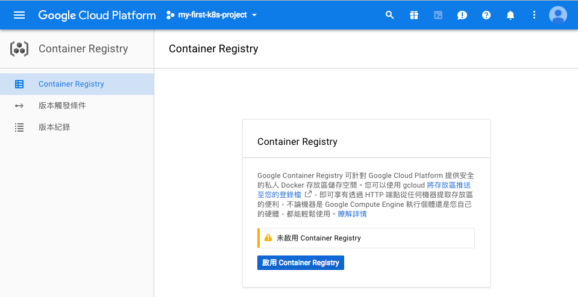
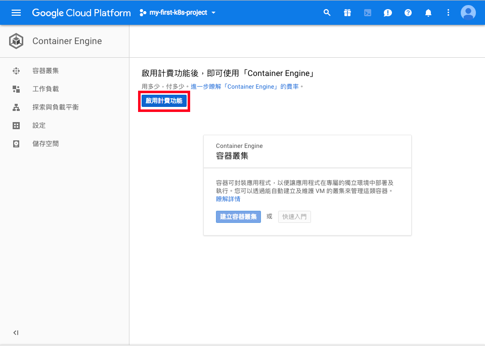
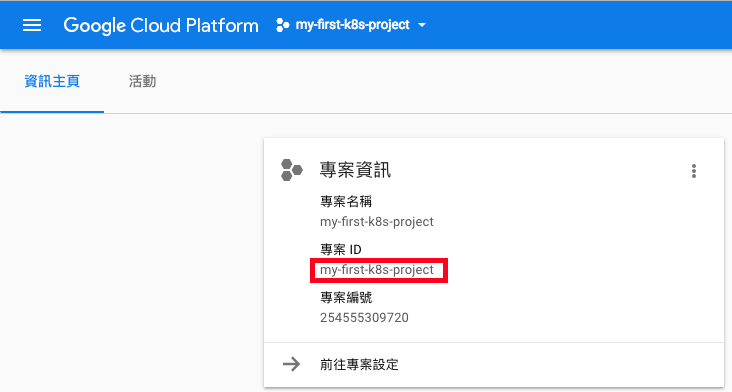

# hello_k8s

照著這個專案步驟走，即可在 Google Cloud Platform 上使用 Kubernetes 執行一個簡單的網站。

此專案使用 Google Cloud Platfrom 所提供的 Cloud Shell，不用在電腦上安裝任何套件，在瀏覽器頁面中即可進行操作。

## 開啟 Cloud Shell

- 打開瀏覽器
- 申請 [GCP account](https://cloud.google.com/)
- 進入 GCP console 主畫面
- 建立一個專案，例如 `my-first-k8s-project`
- 連結帳單帳戶，新用戶有第一年 $300 美金的免費額度
- 啟用 Container Registry



- 啟用計費功能以使用 Container Engine，啟用過程可能需要數分鐘



- 打開左上角的 Activative Google Gloud Shell，就會在頁面下方開啟終端機介面


## 專案設定

取得專案程式碼

```shell
$ git clone https://github.com/CloudMile/hello_kubernetes.git
$ cd hello_kubernetes
```

設定 gcp config

```shell
$ gcloud config set compute/region asia-east1
$ gcloud config set compute/zone asia-east1-a
```

設定儲存`專案名稱`的環境變數，以便後續使用

```shell
$ export PROJECT_ID=$(gcloud config list --format 'value(core.project)')
```

## 建置容器應用 (Container Image)

修改顯示的活動名稱，將以下指令的 `CHANGE_THIS_EVENT` 改成對應的活動名稱，例如 `COSCOP2017`

```shell
$ sed -ie "s/<THIS_EVENT>/CHANGE_THIS_EVENT/g" ./html/index.html
```

建置容器應用，

```shell
$ docker build -t asia.gcr.io/$PROJECT_ID/hello-k8s/app:v1 .
```

將 image 推上 Google Container Registry

```shell
$ gcloud docker -- push asia.gcr.io/$PROJECT_ID/hello-k8s/app:v1
```

## 部署容器應用

建立 clusters

```shell
$ gcloud container clusters create hello-k8s --machine-type g1-small --num-nodes 1
```

指定 `kubectl` 專案

```shell
$ gcloud container clusters get-credentials hello-k8s
```

設定 `web-deployment.yml`，修改 image 的值

```shell
$ sed -ie "s/<YOUR_GCP_PROJECT>/$PROJECT_ID/g" ./web-deployment.yml
```

建立 Pod，Pod 是 Kubernetes 部署的最小單位

```shell
$ kubectl create -f ./web-deployment.yml
```

[option] 更新 Pod

```shell
$ kubectl apply -f ./web-deployment.yml
```

## 建立對外網址

申請 GCP 靜態 IP

```shell
$ gcloud compute addresses create hello-k8s --region=asia-east1
```

設定儲存`靜態 IP`的環境變數，以便後續使用

```shell
$ EXTERNAL_IP=`gcloud compute addresses list | grep -m 1 RESERVED | awk '{ print $3 }'`
```

這是之後查看結果會用到的 IP，先把它記起來

```shell
$ echo $EXTERNAL_IP
```

修改 `web-service.yml` ，將剛剛 `靜態 IP` 取代 `<EXTERNAL_IP>`

```shell
$ sed -ie "s/<EXTERNAL_IP>/$EXTERNAL_IP/g" ./web-service.yml
```

建立 service

```shell
$ kubectl create -f ./web-service.yml
```

更新 service

```shell
$ kubectl apply -f ./web-service.yml
```

## 打開瀏覽器，輸入剛剛記起來的 IP

## 刪除專案 (on Cloud Shell)

`YOUR_PROJECT_ID` 可以從 `資訊主頁 (DASHBOARD)`, `專案資訊 (Project info)` 得知



```
$ gcloud projects delete <YOUR_PROJECT_ID>
```
